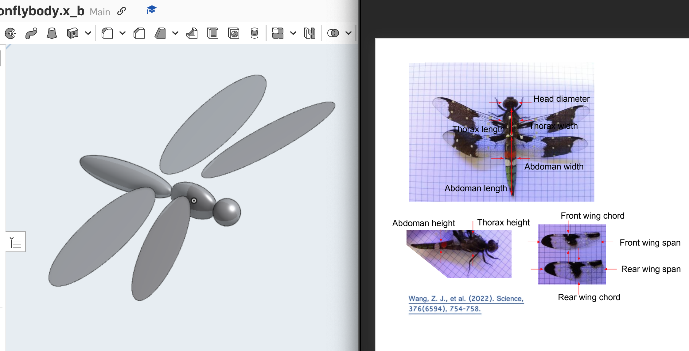

# Geometric Model

The 3D model was simplified from $$Plathemis$$ $$lydia$$ (the common whitetail), comprising 1 welded body and 4 wings. Each wing was modeled as a thin `Ellipsoid` for the convenience of fluid force simulation. The morphological data used for this model was from [published work](https://doi.org/10.1126/science.abg0946).

`newdragonflybody.x_b` is the model file that can be loaded by any parasolid-kernel-based software (like SOLIDWORKS, Onshape, etc). It can also be exported as `.obj` format for creating MuJoCo `mjcf` file. 
