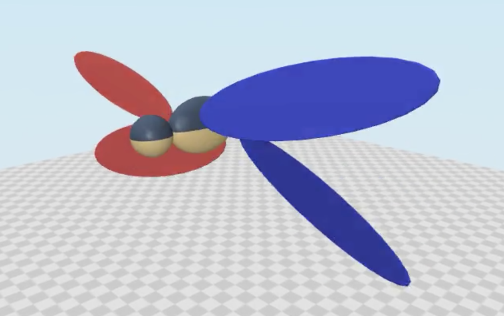

# MuJoCo Model

Kinematic visualization, dynamic simulation, and RL tasks of the dragonfly were based on MuJoCo env. 

In MuJoCo, robot was defined using `mjcf` file (`.xml` format). The `dragonfly_cgs1.xml` which based on the 3D geometic model was used in this project. Note that the `mjcf` is purely numerical and doesn't specify the unit system by default, so we converted all values into CGS (centimeter-gram-second) system. This also prevents the body inertia becoming too small under SI unit, which can cause numerical instability duing simulation. 

`dragonfly-test1.ipynb` records the dragonfly hovering simulation testing process, which validates the kinematics and dynamics of our model. Hovering flight demo is shown here. This pave the way for the robot-learning-aided mid-air recovery task using DDPG. 

