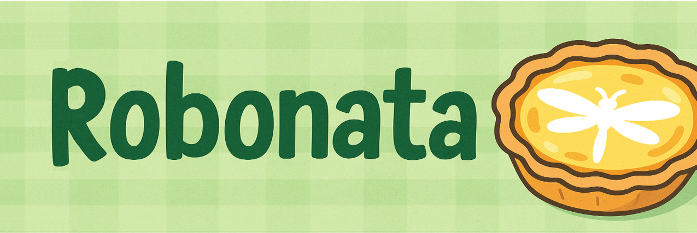

# Robonata

Hi there! This is Cheney. Robonata is a project created for Cornell CS 5756 Robot Learning course, and I hope to keep developing it in the future.

"Robonata" stands for Robot plus $$Odonata$$, which is the order name of dragonflies and damselflies. It provides a body model of dragonfly that aims to facilitate research in flapping-wing robotics, biomechanics, and learning-based control.
